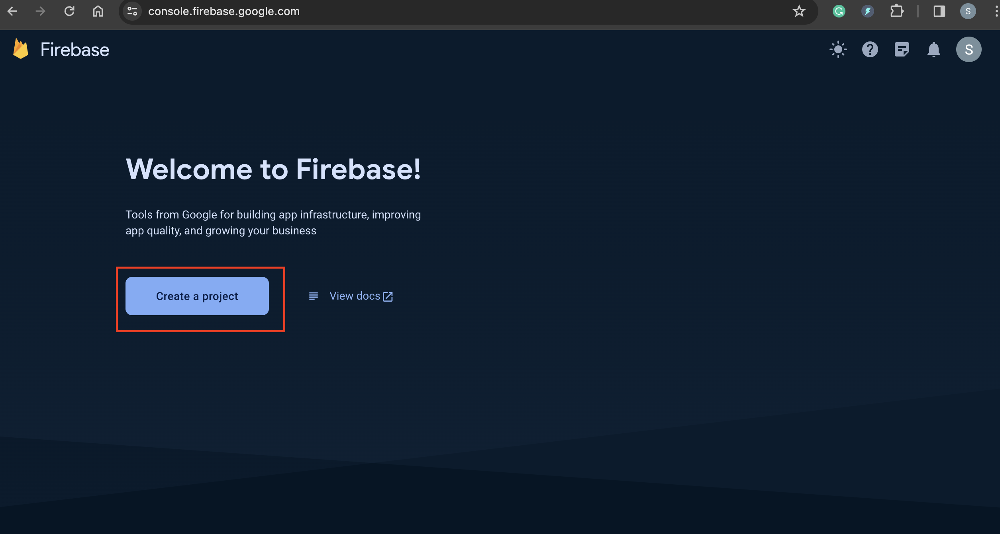
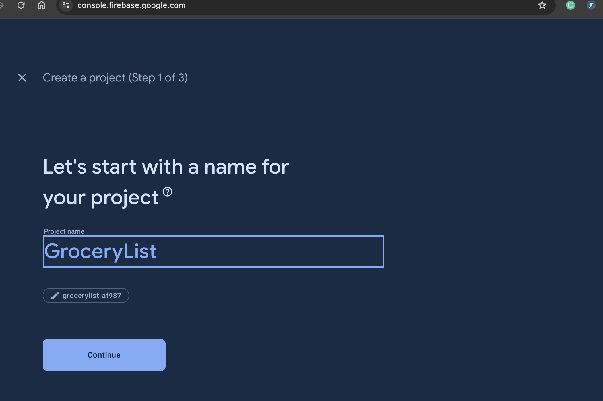
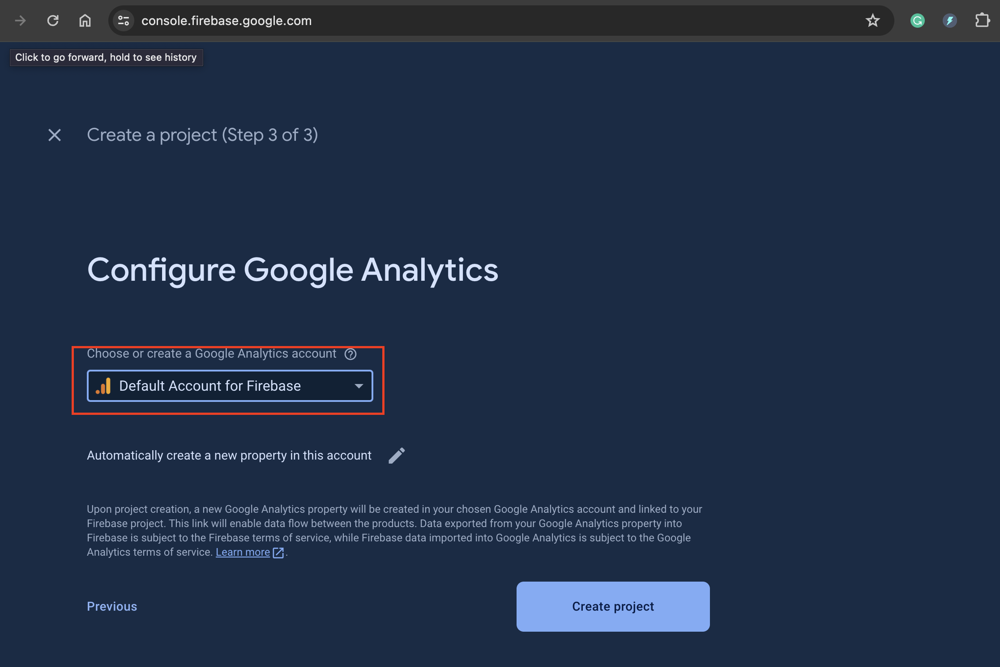
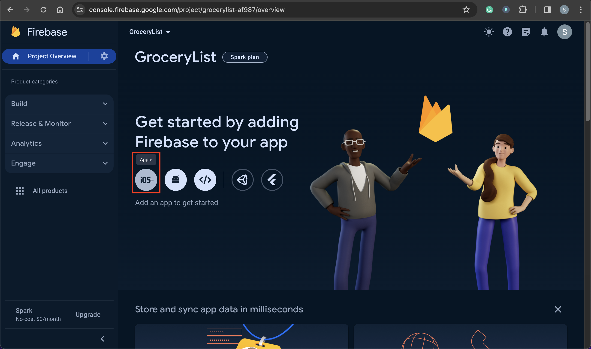

# iOS02-firebase

## Create a project on Firebase

- Firebase url:

  - https://firebase.google.com/

- Go to console

- Create project

- Input project name

- Select an account

---

## Connect iOS app with Firebase project

